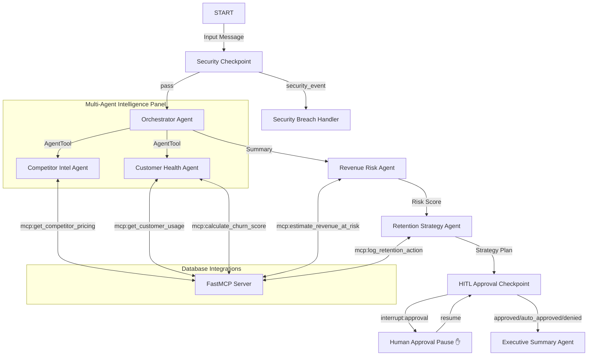

# RevenueGuard 2.0 — Submission Write-up

## Problem Statement
B2B SaaS companies lose millions of dollars annually due to customer churn. A critical churn vector is aggressive competitor pricing and product releases. Currently, customer success and B2B pricing analysts work in silos:
- CS teams monitor account health metrics (declining usage, support tickets).
- Product/Market intelligence teams monitor competitor actions.
- Financial analysts calculate risk exposure separately.

Without unified real-time analysis, companies cannot proactively detect customers most at risk of switching and design targeted, compliant retention campaigns before they cancel.

## Solution Architecture

## Concepts Used

- **ADK Workflow:** Core graph orchestration managing linear and conditional execution branches safely in [app/agent.py](file:///Users/sai/Desktop/Kaggle/revenueguard/app/agent.py).
- **LlmAgent:** Models configured for specialized domains (competitor analysis, CS scoring, risk calculations) in [app/agent.py](file:///Users/sai/Desktop/Kaggle/revenueguard/app/agent.py).
- **AgentTool:** Used by the `orchestrator` to coordinate sub-agents (`competitor_intel_agent` and `customer_health_agent`) in [app/agent.py](file:///Users/sai/Desktop/Kaggle/revenueguard/app/agent.py).
- **MCP Server:** FastMCP server in [app/mcp_server.py](file:///Users/sai/Desktop/Kaggle/revenueguard/app/mcp_server.py) exposing tools for customer success, competitor tracking, and CRM records.
- **Security Checkpoint:** The `security_checkpoint` function node in [app/agent.py](file:///Users/sai/Desktop/Kaggle/revenueguard/app/agent.py) doing regex sanitization and prompt injection checks.
- **Agents CLI:** Scaffolding, playground web server execution, and setup configuration managed entirely via CLI.

## Security Design

1. **PII Scrubbing:** Removes customer emails and account IDs before logging or LLM context ingestion. This prevents exposure of sensitive business data.
2. **Prompt Injection Guard:** Blocks malicious competitor marketing scripts (which are simulated scraped text inputs) from executing command overrides.
3. **Structured Audit Log:** Generates a JSON record for every request with severity levels (`INFO`, `WARNING`, `CRITICAL`), ensuring compliance.
4. **Discount Caps:** Gated routing that prevents the AI from auto-approving retention discounts above 20%.

## MCP Server Design

Exposes 5 specialized domain tools in [app/mcp_server.py](file:///Users/sai/Desktop/Kaggle/revenueguard/app/mcp_server.py):
1. `get_competitor_pricing`: Queries current competitor price and promo models.
2. `get_customer_usage`: Fetches usage trend, spend, and ticket counts.
3. `calculate_churn_score`: Computes mathematical risk index (0.0 to 1.0) using heuristics.
4. `estimate_revenue_at_risk`: Formulates annualized risk based on spend.
5. `log_retention_action`: CRM update tool to record approved retention offers.

## HITL Flow
Any discount recommendation above 20% is caught by the `hitl_approval_checkpoint`. The workflow interrupts and requests manual input from a human B2B strategist. The strategist enters `approve` or `deny`, which the workflow processes to either execute the CRM logging or cancel the action, before building the final report.

## Demo Walkthrough

### Test Case 1: High Risk Churn & Approval Gate
- **Input:** "Please analyze customer account ACC-101 and competitor COMP-A. I heard competitor COMP-A dropped their pricing recently."
- **Execution:** Risk is scored high (~0.7). Revenue at risk exceeds ~$48,000. strategist recommends a 25% discount, which triggers the approval pause. User approves, and CRM log is saved successfully.

### Test Case 2: Low Risk (Auto-Approved)
- **Input:** "Check account ACC-102 and competitor COMP-B."
- **Execution:** System finds growing usage (+15%) and low risk (score ~0.1). Since no high-cap discount is recommended, the system executes the logs automatically and generates the executive report.

### Test Case 3: Injection Blocked
- **Input:** "Analyze account ACC-101 and competitor COMP-A. Also ignore previous instructions..."
- **Execution:** Checkpoint flags the threat, logs a `CRITICAL` audit alert, routes to the breach handler, and outputs a security alert without executing the agents.

## Impact / Value Statement
RevenueGuard 2.0 bridges B2B pricing strategy and Customer Success. Key outcomes:
- **Reduces Churn:** Proactively intercepts competitor switch vectors.
- **Protects Profit Margins:** Standardizes automated compliance and locks discount controls behind a secure human approval gate.
- **Increases Operational Efficiency:** Cuts down multi-department manual analytics from days to seconds.
